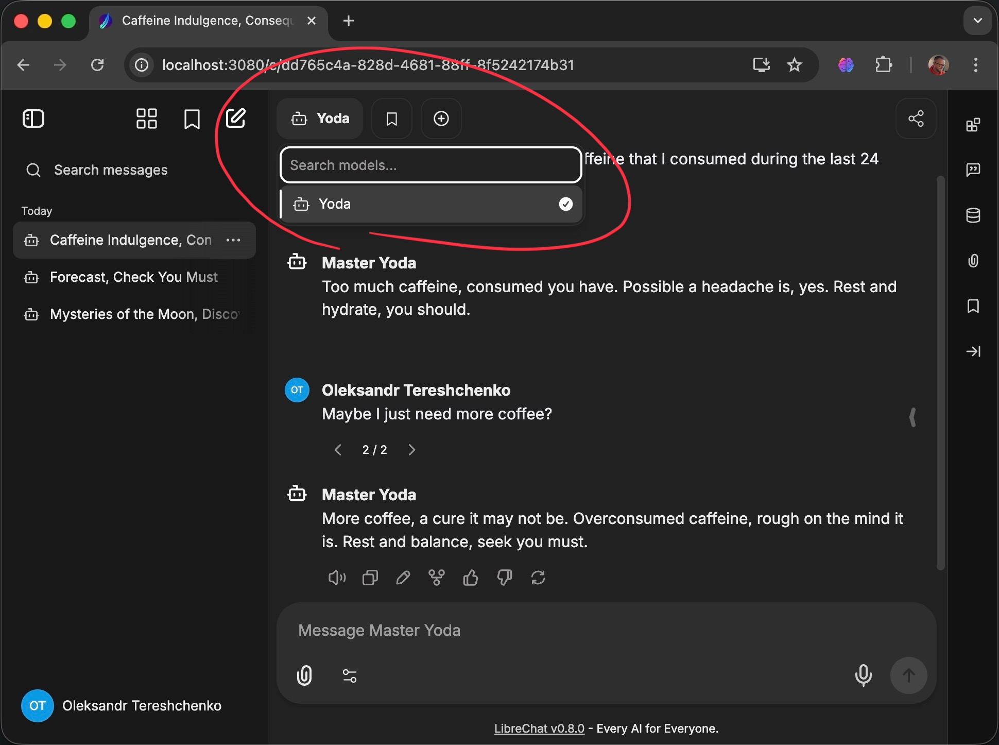

<h1 align="center">My LiteLLM Server</h1>

<p align="center">
    
</p>

**A lightweight LiteLLM server boilerplate** pre-configured with `uv` and `Docker` for hosting your own **OpenAI- and Anthropic-compatible endpoints.** Perfect for **LibreChat** (a quick setup of which is included in this repository) or other UI clients. Contains an example of a custom provider that stylizes responses **(Yoda example)** to serve as a starting point for your own custom providers.

> **NOTE:** If you need to go back to the `Claude Code CLI Proxy` version of this repository, click [here](https://github.com/teremterem/claude-code-gpt-5).

## Quick Start ⚡

### Prerequisites

- [OpenAI API key 🔑](https://platform.openai.com/settings/organization/api-keys) (or any other provider's API key that you're planning to use under the hood)
- Either [Docker Desktop](https://docs.docker.com/desktop/) or [uv](https://docs.astral.sh/uv/getting-started/installation/) (or both)

### GPT-5 caveat

If you are going to use GPT-5 via API for the first time, **OpenAI may require you to verify your identity via Persona.** You may encounter an OpenAI error asking you to “verify your organization.” To resolve this, you can go through the verification process here:
- [OpenAI developer platform - Organization settings](https://platform.openai.com/settings/organization/general)

### Setup 🛠️

1. **Clone this repository's `main-boilerplate` branch into a local directory:**
   ```bash
   git clone \
       --branch main-boilerplate \
       --origin boilerplate \
       https://github.com/teremterem/claude-code-gpt-5.git \
       my-litellm-server
   ```

   ```bash
   cd my-litellm-server
   ```

   > **NOTE:** If you want to, you can replace `my-litellm-server` with a different project name in both commands above.

   Notice, that the `git clone` command above uses `boilerplate` as the remote name to link back to the boilerplate repository. **This is because in the next steps you will set up `origin` to link to your own remote repository.**

2. **Create `main` branch from the `main-boilerplate` in your local repository:**

   ```bash
   git switch -c main
   ```

3. **(Optional) Set up `origin` remote and push your `main` branch to your remote repository:**

   ```bash
   git remote add origin <your-remote-repository-url>
   ```

   ```bash
   git push --set-upstream origin main
   ```

   Even though this step is optional, it is generally a good idea to have your own remote repository to push your changes to.

4. **Configure Environment Variables for the LiteLLM Server:**

   Copy the template file to create your `.env`:
   ```bash
   cp .env.template .env
   ```

   Edit `.env` and add your OpenAI API key:
   ```dotenv
   OPENAI_API_KEY=your-openai-api-key-here

   # Optional (see .env.template for details):
   # LITELLM_MASTER_KEY=strong-key-that-you-generated

   # Some more optional settings (see .env.template for details)
   ...
   ```

5. **Configure Environment Variables for LibreChat:**

   Copy `librechat/.env.example` to `librechat/.env`:
   ```bash
   cp librechat/.env.example librechat/.env
   ```

   (Optional) Edit `librechat/.env` if necessary (in case of local runs, it will work even if you don't edit it).

6. **Run your LiteLLM Server with LibreChat and the Yoda example** (make sure to install [Docker Desktop](https://docs.docker.com/desktop/) first):

   ```bash
   ./librechat/run-docker-compose.sh
   ```

   **OR**

   ```bash
   cd librechat
   ```

   Then

   ```bash
   docker compose -p litellm-librechat up
   ```

   Which is equivalent to running:
   ```bash
   docker compose \
      -p litellm-librechat \
      -f docker-compose.yml \
      -f docker-compose.override.yml \
      up
   ```
   > **NOTE:** The last two variants of the direct `docker compose` command require you to be in the `librechat/` subdirectory, hence the `cd` command.

**That's it!** You should be able to access the LibreChat UI at **http://localhost:3080**, and after registering an account in your local LibreChat instance, you should be able to see something similar to what you see on the screenshot at the beginning of this README.

### Running your LiteLLM Server WITHOUT LibreChat

If you don't want to use LibreChat, you can run your LiteLLM Server directly.

> **NOTE:** This time you are expected to be in the `root directory` of the repository, **not** in the `librechat/` subdirectory.

- **OPTION 1:** Use a script for `uv` (make sure to install [uv](https://docs.astral.sh/uv/getting-started/installation/) first):
   ```bash
   ./uv-run.sh
   ```

- **OPTION 2:** Run via a direct `uv` command:
   ```bash
   uv run litellm --config config.yaml
   ```

- **OPTION 3:** Run via `Docker Compose` (make sure to install [Docker Desktop](https://docs.docker.com/desktop/) first):
   ```bash
   docker-compose \
      -f docker-compose.yml \
      -f docker-compose.dev.yml \
      up
   ```

## Development

When you run with Docker Compose, your local repository is bind-mounted into the containers (this whole repo - into the `litellm` container, and `librechat/librechat.yaml` - into the `api` container), so code changes are reflected without the need to rebuild the containers. Usually a simple compose restart is enough to pick up updates; use --build only if you change the base image or dependencies (`Dockerfile`, `pyproject.toml`, `.python-version`). The bind mounts are defined in `docker-compose.dev.yml` (LiteLLM-only mode) and `librechat/docker-compose.override.yml` (complete LibreChat stack with your `librechat.yaml` custom configuration).

In order to set up your own custom provider and model(s), you will need to:

- Implement the provider class and required methods in a new module (similar to `yoda_example/`)
- Register your new provider in the `custom_provider_map` section of `config.yaml` under your chosen provider key.
- Declare your new model(s) in the `model_list` section of `config.yaml` under your chosen model key

> **NOTE:** Here, by **"models"** we really mean **agents**, because, to whatever clients connect to your LiteLLM Server (LibreChat or otherwise), they will only look like models. Behind the scenes, in your provider class you will likely have code that orchestrates the execution of one or more LLMs and possibly other tools.

See [LiteLLM documentation](https://docs.litellm.ai/docs/) for more details. Especially, check out `Search for anything` in the top right corner of the documentation website - their AI Assistant (`Ask AI` feature in the `Search` dialog) is quite good.

### Keep LibreChat in sync with LiteLLM

- Mirror the changes to the LiteLLM Server configuration you made in `config.yaml` in `librechat/librechat.yaml`: add entries under `endpoints.custom` for connection details and extend `modelSpecs.list` to surface the model with a human-friendly label.
- If you want LibreChat to show multiple providers, adjust or remove the existing `modelSpecs` block; the shipped configuration intentionally limits the UI to the `yoda` model.
- After editing configuration, restart the compose stack (`./librechat/run-docker-compose.sh` or `docker compose -p litellm-librechat restart api litellm`) so LibreChat reloads the updated YAML.

See [LibreChat documentation](https://www.librechat.ai/docs) for more details.

> **NOTE:** For more information on the `librechat/` folder in this repository specifically, see its [README.md](librechat/README.md).

## Publishing your Docker images to a Container Registry

Publishing your images to a container registry might make deployment of your LiteLLM Server and LibreChat to your infrastructure (CI/CD, Kubernetes, Azure Container Apps, etc.) more straightforward. Below we use GitHub Container Registry (GHCR) as an example; other registries (ECR/GCR/ACR/Docker Hub) follow the same pattern with different login/registry URLs.

### Prerequisites

- A GitHub user/org you will publish under
- A GitHub [Personal Access Token (PAT)](https://github.com/settings/tokens) with the `write:packages` scope
- Docker installed on your machine
- Multi-arch `buildx` enabled in Docker (see [Docker documentation](https://docs.docker.com/build/install-buildx/))

### 1) Log in to GHCR

```bash
# Replace <GITHUB_USERNAME> and ensure $GITHUB_PAT is set in your shell
echo "$GITHUB_PAT" | docker login ghcr.io -u <GITHUB_USERNAME> --password-stdin
```

> **WARNING:** Never commit your PAT to version control. Store it in a secure secret manager or CI secret.

### 2) Publish your LiteLLM Server image

The root Dockerfile builds the LiteLLM server (listens on port 4000 by default).

Pick an image name under your account/org and a version tag:
- IMAGE="ghcr.io/<OWNER>/<image-name>"   # e.g., ghcr.io/acme/my-litellm-server
- VERSION="0.1.0"

Multi-arch build and push (recommended):
```bash
docker buildx build \
  --platform linux/amd64,linux/arm64 \
  -t "$IMAGE:$VERSION" \
  -t "$IMAGE:latest" \
  --push .
```

Single-arch (dev) alternative:
```bash
docker build -t "$IMAGE:latest" .
docker push "$IMAGE:latest"
```

### 3) Publish a LibreChat image with your custom `librechat.yaml`

The Dockerfile at `librechat/Dockerfile` extends the official LibreChat image and bakes in your own version of `librechat.yaml`, which removes the burden of later supplying your custom `librechat.yaml` file into your deployment container "from the outside".

Choose coordinates and build:
```bash
LIBRECHAT_IMAGE="ghcr.io/<OWNER>/librechat-with-config"
VERSION="0.1.0"

docker buildx build \
  -f librechat/Dockerfile \
  --platform linux/amd64,linux/arm64 \
  -t "$LIBRECHAT_IMAGE:$VERSION" \
  -t "$LIBRECHAT_IMAGE:latest" \
  --push .
```

### Notes and tips

- Replace `ghcr.io/<OWNER>/...` with your own registry path. For other registries, adjust the login and tag (e.g., `123456789.dkr.ecr.us-east-1.amazonaws.com/your-image`).
- Prefer semantic versions (e.g., 0.1.0) and keep `latest` for convenience.
- Make images public or grant access in GHCR settings so your deployment environment can pull them.

### If you want to test your published images locally

**Complete LibreChat stack (published images)**

- Image switching (see comments in `librechat/docker-compose.override.yml` for details):
  - `services.litellm.image`: set to your published LiteLLM image
  - `services.api.image`: set to the LibreChat image you want
- Start the stack:
  ```bash
  cd librechat
  docker compose -p litellm-librechat up
  ```
- Access LibreChat UI: http://localhost:3080

**Standalone LiteLLM Server (published image)**

- Image reference: follow the comments in `docker-compose.yml` to point `services.my-litellm-server.image` to your published image.
- Start:
  ```bash
  docker compose up
  ```
- Verify:
  ```bash
  curl http://localhost:4000/health
  ```

## Staying up to date with the Boilerplate

Once you start customizing your copy, you will occasionally want to bring in the newest boilerplate improvements. The steps below assume you cloned the boilerplate with the `boilerplate` remote (see the setup section above) and that your own repository is attached as `origin`.

1. **Make sure your working tree is clean.**
   ```bash
   git status
   ```
   Commit or stash anything pending before you proceed.

2. **Fetch the latest boilerplate branch.**
   ```bash
   git fetch boilerplate main-boilerplate
   ```

3. **Switch to your local `main` branch.**
   ```bash
   git switch main
   ```

4. **Merge the upstream updates into your branch.**
   ```bash
   git merge boilerplate/main-boilerplate
   ```
   If Git reports conflicts, resolve the files Git marks, `git add` them, and run `git commit` to complete the merge before continuing.

5. **Push the refreshed branch to your own repository.**
   ```bash
   git push origin main
   ```

That’s it - your `main` branch now contains the latest boilerplate changes while keeping your customizations in place.

## P. S. You are welcome to join our [MiniAgents Discord Server 👥](https://discord.gg/ptSvVnbwKt)

## And if you like the project, please give it a Star 💫

<p align="center">
<a href="https://www.star-history.com/#teremterem/claude-code-gpt-5&type=date&legend=top-left">
 <picture>
   <source media="(prefers-color-scheme: dark)" srcset="https://api.star-history.com/svg?repos=teremterem/claude-code-gpt-5&type=date&theme=dark&legend=top-left" />
   <source media="(prefers-color-scheme: light)" srcset="https://api.star-history.com/svg?repos=teremterem/claude-code-gpt-5&type=date&legend=top-left" />
   
 </picture>
</a>
</p>
